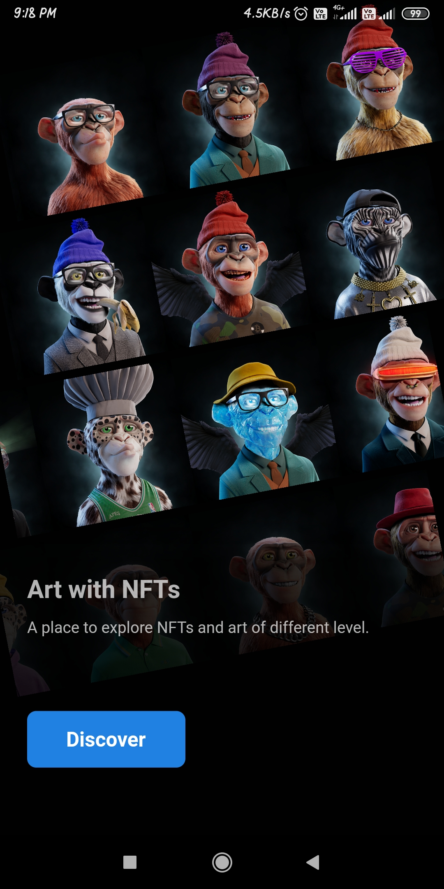
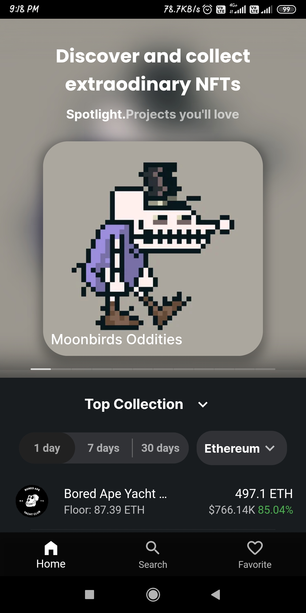
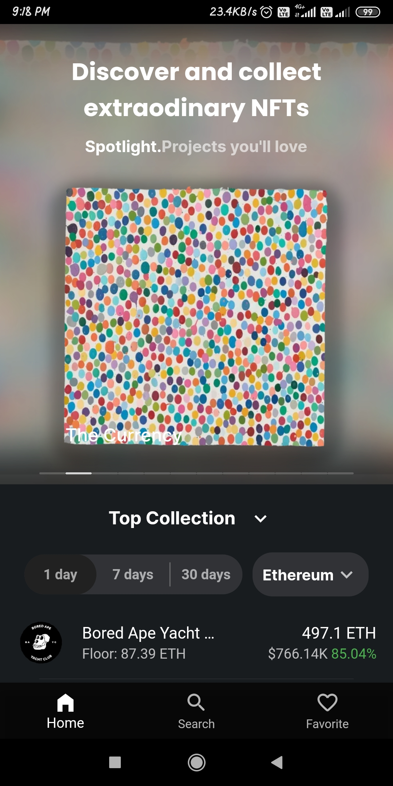
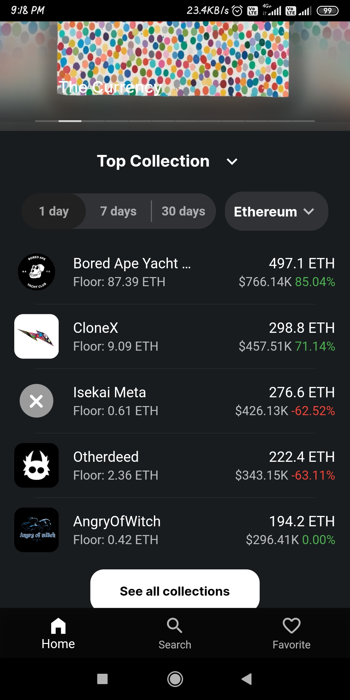
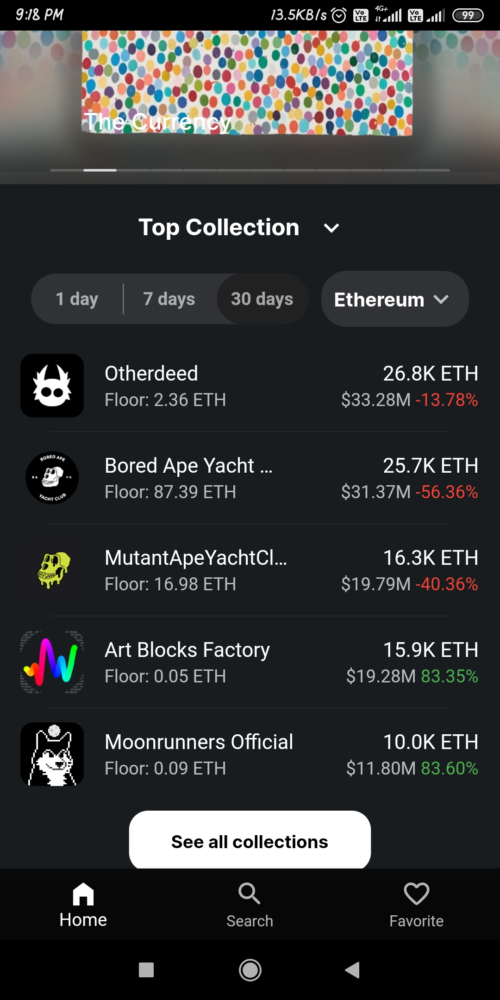
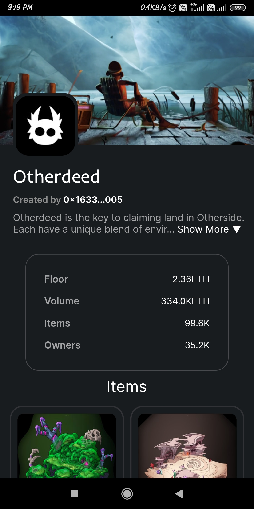
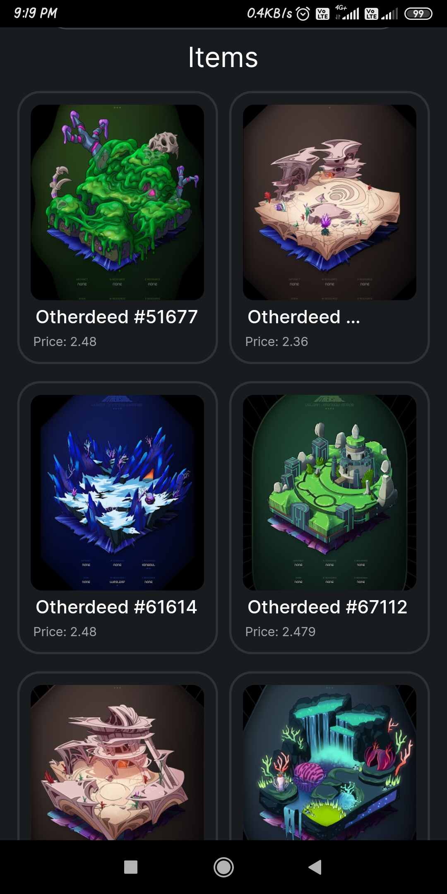

# NFT Museum
A flutter project to explore the world of NFTs and APIs

### Purpose of this project
The purpose of this project is to explore the flutter and NFT APIs at the same time. When I saw that there are very less applications which just shows NFTs and no other crap, I decided to hope on this journey. This project is a ~~simple~~ complex application with ton of APIs talking to each other and rendering data while handling possible exceptions. The UI is fully written in `dart` programming language using `flutter` library and for data `Rarible API` has been used. I have not written the backend, it's all APIs talking to each other.

### UI sample
The UI is made simple and minimal, yet beautiful. 

<p>
    
    
    
    
    
    
    
</p>

### How to run
Download and Install apk from [release](https://github.com/Tsuzat/nft-museum/releases)
*OR*
build from source
First Install [Flutter](https://docs.flutter.dev/get-started/install)
```bash
$ git clone https://github.com/Tsuzat/nft-museum
$ cd nft-museum
$ flutter pub get
$ flutter build apk –-split-per-abi
```
or run the app in available devices
```bash
$ flutter run
```

### TODO
- [x] To Add collection Screen
- [x] To Add webview for collections
- [x] To Add items of a collection
- [ ] To Add search screen
- [ ] To Add favorite screen
- [ ] To Add favorite screen
- [ ] To Add screen for NFT creator
- [ ] To Add a custom icon for application
